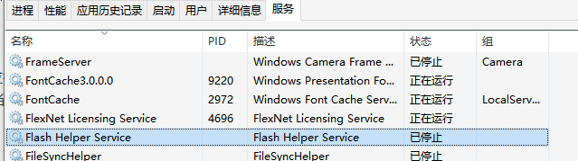
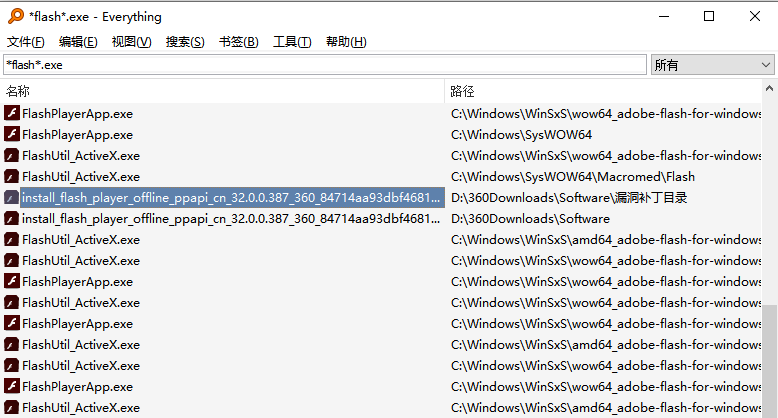
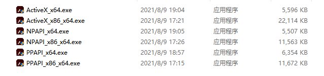
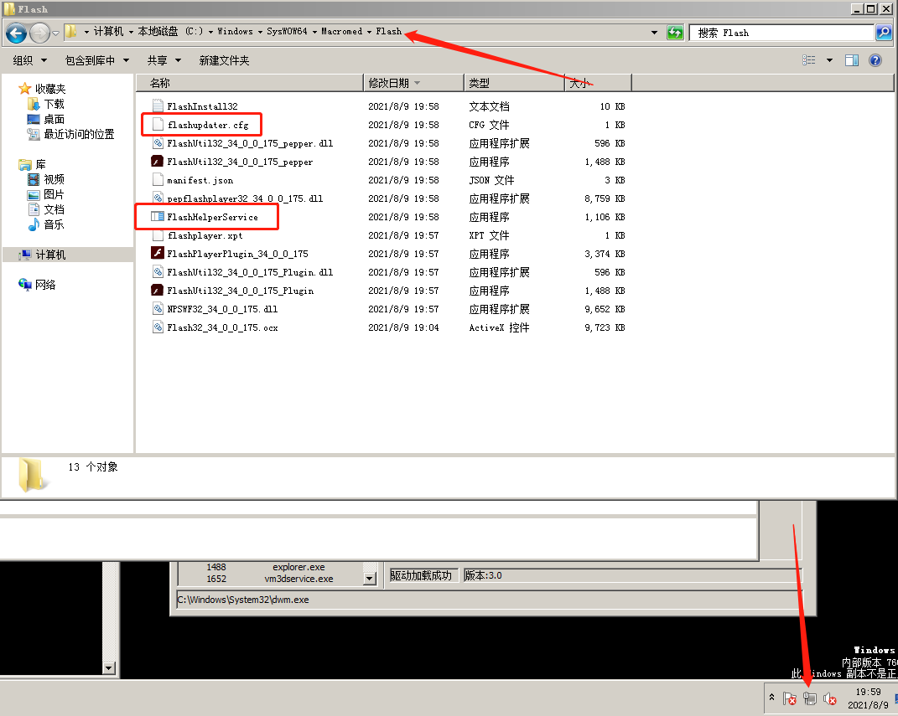
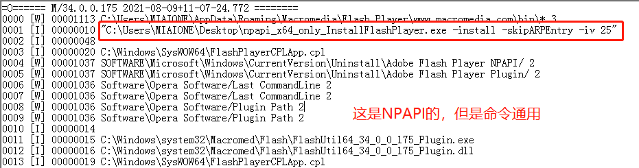
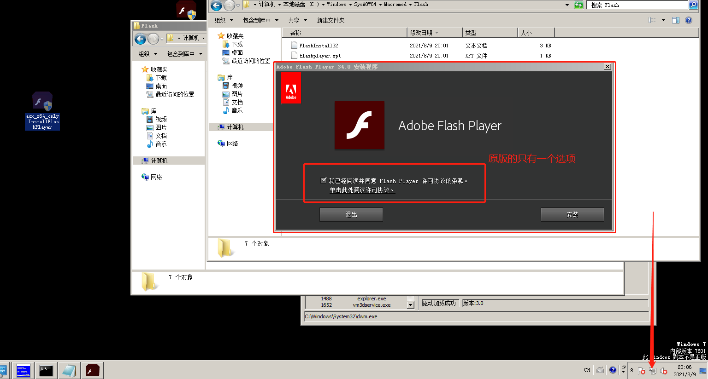
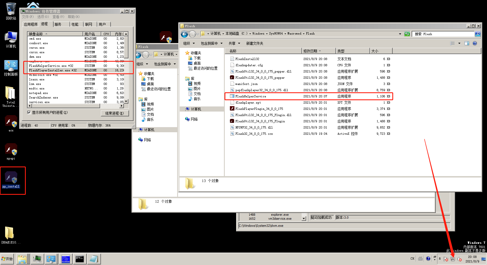
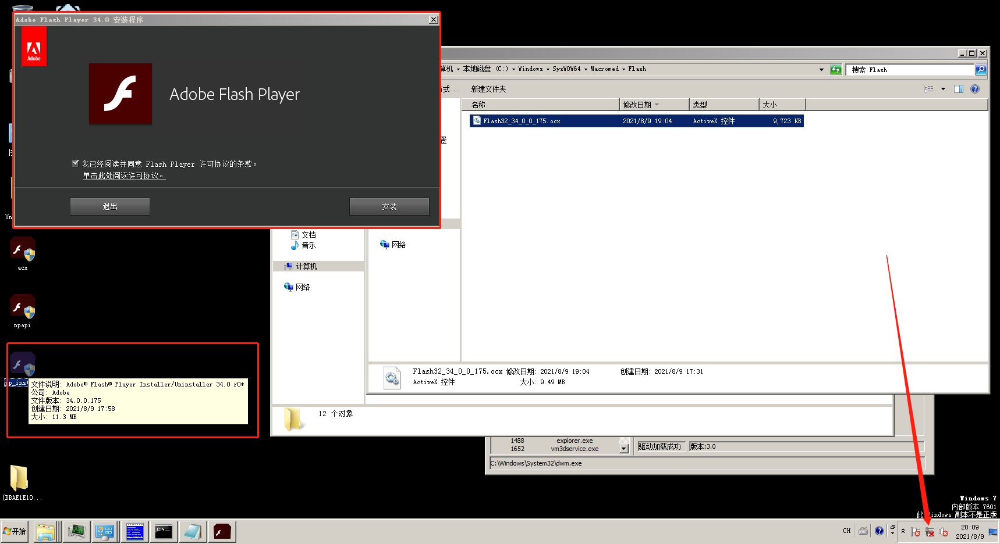
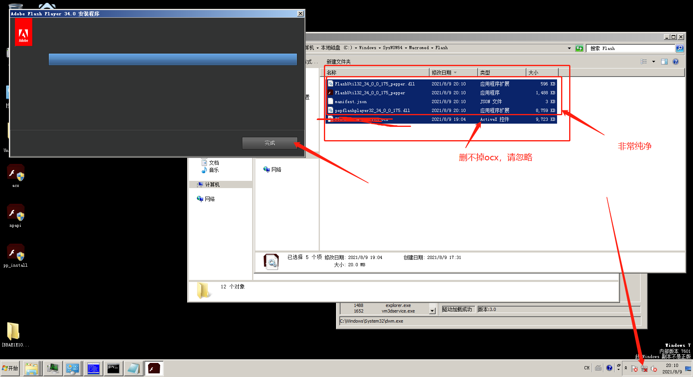
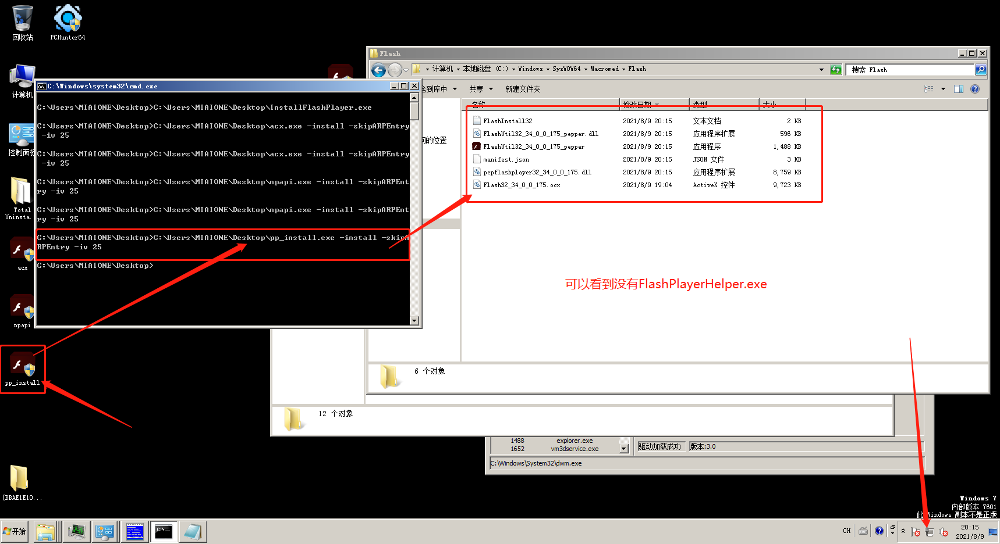

# Flash Player 32 PPAPIOffline

#### 前言

由于Flash的没落，Adobe决定不再维护Flash，结果国内的代理却特别恶心，加入了所谓的“Flash Player Helper”，并想借着“页游xxx传奇来谋利”，作为一名程序员，我看不惯对绿色软件的调油加醋，于是便有了这篇文章。

### 问题溯源

我的电脑上面也安装了由这个公司发行的flash，但是却没有广告，我到服务里面一看他的流氓服务被关闭了，进程列表中也没有这个进程，但是根据网上大多数的反馈来看，这种方法应该在34版本当中已经失效了，而我电脑上安装的版本是32，所以这并不是我电脑没有广告的根本原因。




于是我通过Everything搜索了flash的相关文件，起初我搜索的是DLL文件，以为他能对文件做深度的修改，但是经过我深入发现他的能力并没有这么强，在搜索的列表当中，我看到了360漏洞补丁目录的安装包，我好奇的打开了这个安装包，也同样安装了那个流氓服务，但是在没有任何的参数情况下，却没有界面，文件名也显示offline离线版，看来这个软件不简单，有可能是定制版。



我又通过Everything重新在运行的时候动态搜索了一下，发现它会释放出子安装文件，子安装文件，又套娃的放出了一个安装文件，我分别运行了这两个文件，在flash的安装目录里面，我发现了如下文件。


FlashPlayerInstaller.exe会安装全部的版本，而由它释放的InstallFlashPlayer.exe，只会安装64位版本，由此得出32位版本无法被独立的提取，应该是直接被这个程序安装进系统。

### 研究flash.cn的安装包

通过我不断的对其进行观察，发现它在安装的时候并没有安装那个流氓服务，当我想把他准备发布到网上供大家下载的时候，我突然想到官网上还有三个在线版本的安装包，不如也来一起分析一下，如果有同样的行为，岂不可以获得到最新的版本，还没有广告。

通过在虚拟机中安装这三个程序，发现他们并不会直接的把安装包下载到某个目录，而是下载一个没有扩展名，而名字主体是GUID的程序，但是进程列表中可以看到这个程序已经被加载启动，我右键打开文件位置，盲猜就是个安装程序，只不过是通过动态加载罢了。


而且，所有能删除的exe文件都会删除，估计是怕提取（下文印证了这句话），安装包套了3层，官网只发布在线版又相当于套了一层，不过呢，我都提取出来了，怎么样？而且每个安装包也会像之前提到那个32旧版本的安装包，释放出一个64位版本的安装包，而且64位版本的安装包全都是官方版本，双击安装都是没有广告的，其实这个特点我从安装目录就发现了，流氓软件的程序服务只在32位版本当中，也就是SysWOW64文件夹





不过这大小惊到我了，我电脑上360下载的那个有小22MB（只有PPAPI），还不含ActiveX和NPAPI的

通过翻阅该日志文件，我注意到当通过某些参数传向该应用时，该应用将不会安装那个流氓服务



进一步研究发现，x64独立版本在联网、断网均不会安装流氓服务，而其父安装包，在联网后仍然会静默安装并下载流氓服务，但断网后安装会弹出安装窗口且不会安装流氓服务。


原版x64




联网父安装包



断网父安装包





但是我也不能断网安啊，反正我是忍不了，于是就有了下面的通用免广告参数

```text
-install -skipARPEntry -iv 25
```

x64独立版没有广告，如需静默安装只需一个参数

```text
-install
```



那六个安装包我已经放到了我的Github/Gitee的Release

